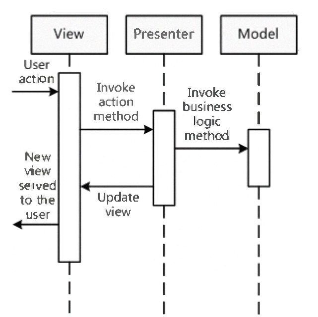
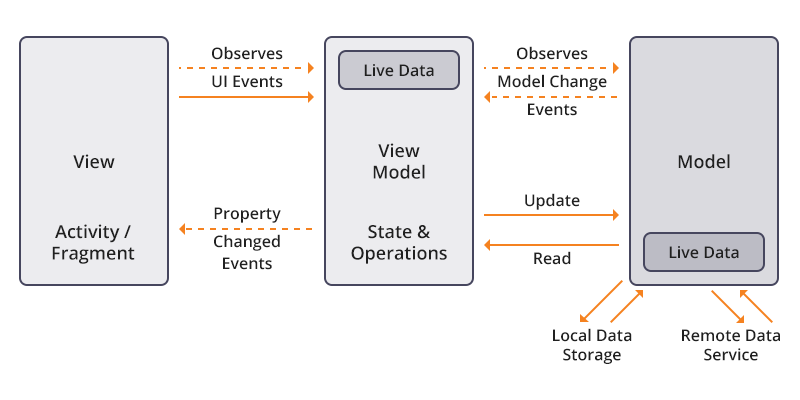
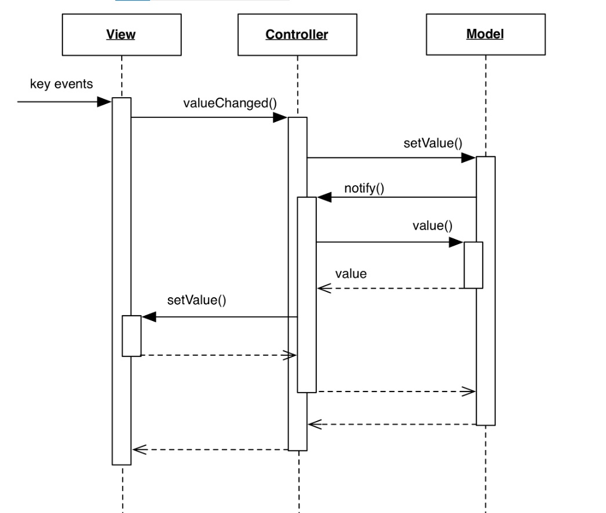

# MVx-patterns-in-Unity
I used the most famous MVx patterns in the Unity engine.
# MVC - Model-View-Controller

# MVP - Model-View-Presenter

# MVVM - Model-View-ViewModel

# MVA - Model-View-Adapter
